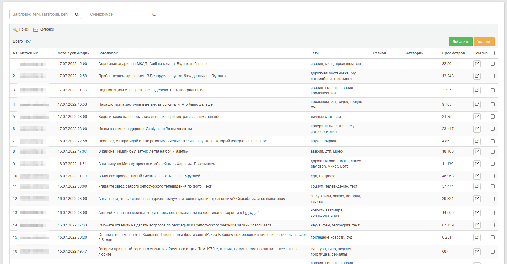
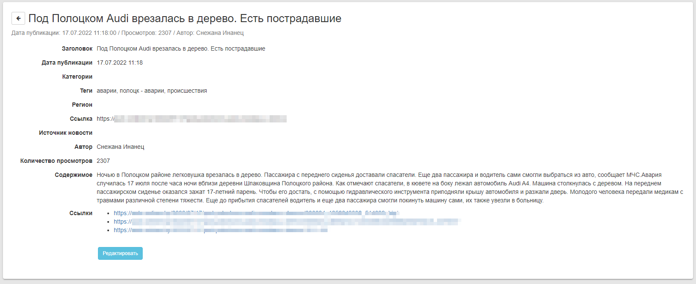

# Sources

Модуль для получения и обработка данных из открытых источников, их аналитика\
Создан на базе фреймворка [Core2](https://github.com/easterism/core2)

## Функции

- Получение данных из новостных сайтов
- Получение данных из youtube роликов (расшифровка видео)
- Вывод данных в виде наглядных графиков

## Примеры

Список полученных записей\

Просмотр записи\

